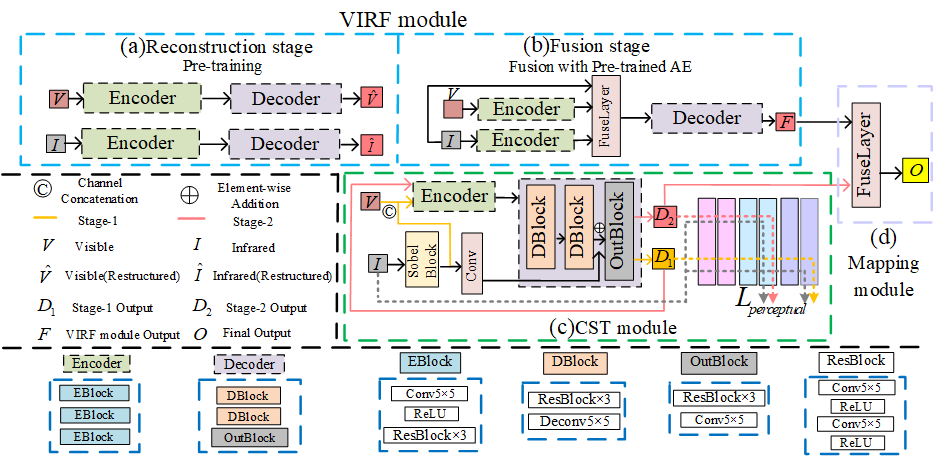

# DSTFuse


Codes for ***DSTFuse: Enhancing Deblurring via Style Transfer for Visible and Infrared***



## Update

- [2024/7] Release inference code for infrared-visible image fusion.

## Abstract

Infrared and visible image fusion aims at obtaining fused images that keep advantages of source images, *e.g.*, detailed textures and clear edge structures. To tackle the challenge in modeling features from visible image under motion blur and low light conditions, we propose a novel fusion framework, DSTFuse, which aims to leverage infrared image as the style image and enable it to perform style transfer on the visible image to efficiently eliminate motion blur. Specifically, DSTFuse contains a Cross-Modality Style Transfer Module (CST-module) that collect appropriate style information from the infrared image and guide the transformation of blurry objects into the corresponding style while preserve all other elements without alteration. The output of CST-module is integrated with the image with a multitude of visible features from another module and mapped into final image. Extensive experiments show that DSTFuse achieves promising results in infrared-visible image fusion task. And it is also shown that DSTFuse can boost the performance in downstream infrared-visible object detection.

## 🌐 Usage

### ⚙ Network Architecture

Our DSTFuse is implemented in ``net.py``.

### 🏄 Testing

**1. Virtual Environment**

```
# create virtual environment
conda create -n dstfuse python=3.8
conda activate dstfuse
# select pytorch version yourself
# install dstfuse requirements
pip install -r requirements.txt
```


**2. Pretrained models**

Pretrained models are available in [this link](https://pan.baidu.com/s/1rBeaiABlTKuQl8imT9NG_w?pwd=14n7)
And you can add the models to our ``model`` folder.
```
-DSTFuse
---|data
---|model  <-- (add model here)  
---|utils   
```

**3. Test data**

The test data has been stored in ```'./data/test_image'```
```
-DSTFuse
---|data
------|test_image
---------|010018_vis.jpg
---------|010018_ir.jpg
```

**4. Results of testing**

If you want to infer with our DSTFuse and obtain the fusion results, please run 
```
python test.py
``` 
